# How-To: Deploy Variant A2 on AWS with Amazon Bedrock AgentCore

Status: Draft
Owner: TBD
Last updated: 2026-07-06

Parent specs:
- [Power Platform Private MCP Proxy Connector Spec](./power-platform-mcp-private-proxy-connector-spec.md)
- [Variant A2: Thin MCP Adapter](./variant-a2-thin-mcp-adapter-spec.md)

Reference implementation: [`shim-agentcore-bedrock/`](../shim-agentcore-bedrock/)

## What this guide covers

This is a step-by-step deployment guide for Variant A2 (thin adapter,
single backend server) where the MCP server itself runs as a container
hosted in **Amazon Bedrock AgentCore Runtime**, on AWS. It walks through:

1. Deploying an MCP server to AgentCore Runtime.
2. Establishing a private network path from the on-premises data gateway
   into the AWS VPC, and from the shim to AgentCore Runtime.
3. Deploying the shim (this repo's `shim-agentcore-bedrock/`) to ECS
   Fargate behind an internal Network Load Balancer.
4. Wiring the Power Platform custom connector to the shim through the
   gateway.
5. Validating the end-to-end path and hardening it for production.

It assumes you have already read the Variant A2 spec, particularly
[Why not skip the proxy and call MCP directly?](./power-platform-mcp-private-proxy-connector-spec.md#why-not-skip-the-proxy-and-call-mcp-directly)
and [MCP session management](./variant-a2-thin-mcp-adapter-spec.md#mcp-session-management),
since this guide does not repeat that reasoning.

## Why AgentCore specifically simplifies Variant A2

Three Amazon Bedrock AgentCore capabilities remove work this shim would
otherwise have to do itself:

1. **AgentCore Runtime hosts MCP servers directly.** Point a Streamable
   HTTP MCP server (built with the standard `mcp` Python SDK, for example)
   at container port 8000 path `/mcp`, and `agentcore deploy` packages,
   uploads, and runs it. AgentCore also auto-generates and manages the
   `Mcp-Session-Id` header for stateless MCP servers, and handles microVM
   session affinity/cold starts for you.
2. **IAM SigV4 is the default auth mechanism** for invoking a hosted
   runtime -- "the default authentication and authorization mechanism that
   works automatically without additional configuration, similar to other
   AWS APIs" (AWS docs). This means the shim never needs its own OAuth
   client registration or a Cognito/Auth0/Entra ID app just to talk to
   AgentCore -- it authenticates with its own IAM role, the same way any
   other AWS SDK call would.
3. **AgentCore has a native PrivateLink interface endpoint**
   (`com.amazonaws.<region>.bedrock-agentcore`, data plane, `Runtime`
   primitive supported). With private DNS enabled, the region's default
   `bedrock-agentcore.<region>.amazonaws.com` endpoint transparently
   resolves to a private ENI in your VPC -- no code change, no special
   endpoint URL, just a VPC endpoint resource.

Net effect: the shim's job shrinks to exactly what the Variant A2 spec says
it should do -- construct/parse MCP JSON-RPC, manage sessions, flatten SSE,
enforce the allow-list, authenticate the *caller* -- because AgentCore
already handles hosting, backend-auth-to-the-container, and private
connectivity to the runtime itself.

## Architecture

```mermaid
flowchart LR
    Maker[Power Apps / Power Automate / Copilot Studio] --> CC[Custom Connector]
    CC --> GW[On-premises data gateway]
    GW -->|Direct Connect / Site-to-Site VPN| NLB[Internal NLB]
    NLB --> ECS[ECS Fargate: shim container]
    ECS -->|SigV4, boto3 invoke_agent_runtime| VPCE[PrivateLink endpoint\ncom.amazonaws.region.bedrock-agentcore]
    VPCE --> AgentCore[AgentCore Runtime]
    AgentCore --> MCP[MCP server container\n0.0.0.0:8000/mcp]

    subgraph OnPrem[On-premises / customer network]
        GW
    end

    subgraph AWSVPC[AWS VPC - private subnets]
        NLB
        ECS
        VPCE
    end

    subgraph AWSManaged[AWS-managed]
        AgentCore
        MCP
    end
```



Two private hops, end to end:

1. **Gateway → shim**: over Direct Connect or a Site-to-Site VPN into the
   VPC, terminating at an internal NLB (never a public endpoint).
2. **Shim → AgentCore**: over the `bedrock-agentcore` PrivateLink interface
   endpoint (never the public `bedrock-agentcore.<region>.amazonaws.com`
   endpoint over the internet).

## Prerequisites

- An AWS account with permission to create VPC endpoints, IAM roles, ECR
  repositories, ECS/Fargate resources, Secrets Manager secrets, and ELBv2
  resources.
- A VPC with private subnets (at least two AZs) that already has, or will
  have, private connectivity to your on-premises network via **AWS Direct
  Connect** or a **Site-to-Site VPN**. Building that connectivity from
  scratch is heavily account- and network-specific and is out of scope for
  this guide -- see
  [AWS Direct Connect](https://docs.aws.amazon.com/directconnect/latest/UserGuide/Welcome.html)
  and [AWS Site-to-Site VPN](https://docs.aws.amazon.com/vpn/latest/s2svpn/VPC_VPN.html).
- An on-premises data gateway already installed and registered to your
  Power Platform tenant, on a network that can route to the VPC over the
  path above.
- Docker, the AWS CLI v2, and Python 3.12 available wherever you build and
  deploy the shim image.
- The [`shim-agentcore-bedrock/`](../shim-agentcore-bedrock/) source in
  this repo.

## Feasibility pre-flight checklist

Work through this checklist **before** starting Step 1. The steps below
assume every item here is already true or already scheduled; none of them
are things this guide, the CloudFormation template, or the shim code can
solve for you. The single most common reason this architecture stalls is
skipping straight to Step 3 before confirming the network items below.

- [ ] **On-premises ⟷ AWS private connectivity already exists (or is
      actively being provisioned) for the target AWS account/VPC.** Either
      AWS Direct Connect or a Site-to-Site VPN, reaching the specific VPC
      you'll deploy into. This is the load-bearing prerequisite for the
      entire design — get an explicit yes/no from your network team, not an
      assumption. If it doesn't exist yet, treat this as a separate
      networking project with its own lead time (often weeks), not a task
      inside this guide.
- [ ] **Route tables are confirmed bidirectional.** Traffic must flow
      on-prem → VPC (gateway to shim) and the return path, across whatever
      firewalls/NSGs sit in between.
- [ ] **DNS resolution path from the gateway host to the shim's internal
      NLB name is solved, not just planned.** Resolving an internal NLB DNS
      name from on-premises typically needs either Route 53 Resolver
      inbound/outbound endpoints with conditional forwarding configured on
      your on-prem DNS servers, or a documented fallback of pinning the
      gateway's data source to the NLB's static per-AZ private IPs. Decide
      which approach you're using before Step 6, since the guide's
      `Test-NetConnection` check in Step 6 only tells you resolution
      succeeded or failed, not how to fix it.
- [ ] **An on-premises data gateway is already installed and registered** to
      your Power Platform tenant, on a network segment that has the private
      path above.
- [ ] **Caller auth scheme is decided up front: Entra ID OAuth, not Basic.**
      Confirm this before writing `server.yaml` in Step 5 — see
      [Why OAuth Entra ID, not Windows Integrated Auth](#why-oauth-entra-id-not-windows-integrated-auth).
      The example config's Basic auth block is a local-dev convenience, not
      a production recommendation.
- [ ] **The shim's subnet has outbound HTTPS egress to `login.microsoftonline.com`**
      if you're using `oauthEntraId` (the only legitimate non-private
      dependency in this design — see the Troubleshooting table's
      `401 Unauthenticated` row).
- [ ] **AgentCore Runtime is left on its IAM/SigV4 default — no inbound
      OAuth/JWT authorizer or Cognito pool configured on the runtime.**
      If a different, non-shim caller later needs OAuth access to the same
      runtime, revisit the PrivateLink endpoint policy: AWS requires the
      endpoint policy's `Principal` to be `*` for OAuth-based calls to
      succeed, which stops constraining callers to specific IAM principals.
      Confirm this tradeoff is acceptable before enabling it.
- [ ] **You can name a specific, single `AgentRuntimeArn`.** This
      architecture fronts exactly one MCP server; if you have (or expect)
      more than one, re-read the parent spec's
      [When to use A2 vs A1](./variant-a2-thin-mcp-adapter-spec.md#when-to-use-a2-vs-a1)
      before continuing.
- [ ] **Someone owns the AWS-side IAM/PrivateLink/ECS provisioning
      permissions** listed in [Prerequisites](#prerequisites) — creating VPC
      endpoints, IAM roles, ECR repos, and ELBv2 resources typically needs
      account-admin-adjacent access that not every team has by default.

If any box above is unchecked, resolve or explicitly schedule it first —
treat Steps 1-8 below as the build-out that follows a "go" decision on this
checklist, not as a way to discover these gaps.

## Step 1: Deploy the MCP server to AgentCore Runtime

If you already have an MCP server hosted on AgentCore Runtime, skip to
[Step 2](#step-2-decide-your-private-connectivity-path). Otherwise, at a
minimum:

```bash
pip install mcp
npm install -g @aws/agentcore
```

```python
# my_mcp_server.py
from mcp.server.fastmcp import FastMCP

mcp = FastMCP(host="0.0.0.0", stateless_http=True)

@mcp.tool()
def get_customer_balance(customer_id: str) -> dict:
    """Look up a customer's account balance."""
    ...

if __name__ == "__main__":
    mcp.run(transport="streamable-http")
```

```bash
agentcore create --protocol MCP
# copy my_mcp_server.py into the generated project, point the entrypoint at it
agentcore deploy
```

`agentcore deploy` prints an agent runtime ARN like:

```text
arn:aws:bedrock-agentcore:us-east-1:123456789012:runtime/my_mcp_server-xyz123
```

Save this ARN -- it is the `AgentRuntimeArn` parameter used throughout the
rest of this guide.

**Do not configure an inbound JWT/OAuth authorizer or a Cognito user pool
for this runtime.** Leave authentication at its IAM SigV4 default; that is
what lets the shim call it with its own ECS task role and nothing else, per
[Why AgentCore specifically simplifies Variant A2](#why-agentcore-specifically-simplifies-variant-a2)
above. The Cognito/OAuth walkthrough in AWS's own MCP-on-Runtime tutorial
is only needed if some *other, non-shim* caller needs to invoke the runtime
directly with a bearer token -- it is not needed for this architecture.

Validate the deployment before moving on, from a machine with your AWS
credentials configured:

```python
import boto3, json
client = boto3.client("bedrock-agentcore", region_name="us-east-1")
resp = client.invoke_agent_runtime(
    agentRuntimeArn="arn:aws:bedrock-agentcore:us-east-1:123456789012:runtime/my_mcp_server-xyz123",
    runtimeSessionId="manual-validation-session-000000000000000",  # must be 33-256 chars
    contentType="application/json",
    accept="application/json, text/event-stream",
    payload=json.dumps({"jsonrpc": "2.0", "id": 1, "method": "tools/list", "params": {}}).encode(),
)
print(resp["contentType"], resp["response"].read())
```

## Step 2: Decide your private connectivity path

Confirm (with your network/security admin) which private path already
connects, or will connect, your on-premises network to the AWS VPC:

- **AWS Direct Connect** -- dedicated, lowest latency and jitter, more
  lead time and cost to provision.
- **Site-to-Site VPN over the internet** -- faster to stand up, still
  private (IPsec-encrypted), higher latency variance.

Either way, the result this guide needs is: routes exist so that hosts in
your chosen private subnets are reachable from the on-premises network
that hosts the Power Platform on-premises data gateway, and vice versa.

## Step 3: Deploy the PrivateLink endpoint, IAM roles, and ECS service

The CloudFormation template
[`infra/cloudformation/shim-agentcore-vpc-privatelink.yaml`](../shim-agentcore-bedrock/infra/cloudformation/shim-agentcore-vpc-privatelink.yaml)
provisions:

- The `com.amazonaws.<region>.bedrock-agentcore` interface VPC endpoint
  (PrivateLink, private DNS enabled).
- A task execution role (pulls the image, reads the config secret, writes
  logs) and a separate task role scoped to exactly
  `bedrock-agentcore:InvokeAgentRuntime` on your one `AgentRuntimeArn` --
  nothing broader.
- An ECS Fargate cluster, task definition, and service.
- An internal Network Load Balancer + target group with an HTTP health
  check against `/health`.

You will build the image and create the config secret in Steps 4-5 before
this stack can actually run tasks successfully, but you can create the
stack first (the service will simply fail to reach a steady state as
Fargate cannot yet pull the image) or after -- ordering the resources
doesn't matter for CloudFormation itself.

```powershell
aws cloudformation deploy `
  --template-file shim-agentcore-bedrock\infra\cloudformation\shim-agentcore-vpc-privatelink.yaml `
  --stack-name agentcore-mcp-shim `
  --capabilities CAPABILITY_IAM `
  --parameter-overrides `
    VpcId=vpc-0123456789abcdef0 `
    PrivateSubnetIds=subnet-aaaa,subnet-bbbb `
    OnPremCidr=10.20.0.0/16 `
    AgentRuntimeArn=arn:aws:bedrock-agentcore:us-east-1:123456789012:runtime/my_mcp_server-xyz123 `
    ImageUri=123456789012.dkr.ecr.us-east-1.amazonaws.com/agentcore-mcp-shim:1.0.0 `
    ShimConfigSecretArn=arn:aws:secretsmanager:us-east-1:123456789012:secret:agentcore-mcp-shim-config-abc123
```

(You'll fill in the last two parameters for real once you complete Steps 4
and 5; use placeholder ARNs for a first `deploy` if you want to confirm the
networking/IAM resources alone first, then `deploy` again after.)

After the stack is up, confirm the PrivateLink endpoint is healthy:

```powershell
aws ec2 describe-vpc-endpoints --vpc-endpoint-ids <VpcEndpointId-from-stack-outputs>
```

`State` should be `available` and `PrivateDnsEnabled` should be `true`.

## Step 4: Build and push the shim container image

```powershell
cd shim-agentcore-bedrock
aws ecr create-repository --repository-name agentcore-mcp-shim --region us-east-1
aws ecr get-login-password --region us-east-1 | docker login --username AWS --password-stdin 123456789012.dkr.ecr.us-east-1.amazonaws.com

docker build -t agentcore-mcp-shim:1.0.0 .
docker tag agentcore-mcp-shim:1.0.0 123456789012.dkr.ecr.us-east-1.amazonaws.com/agentcore-mcp-shim:1.0.0
docker push 123456789012.dkr.ecr.us-east-1.amazonaws.com/agentcore-mcp-shim:1.0.0
```

This is the `ImageUri` value for Step 3. The image is the same for every
site/deployment -- see the next step for why config doesn't need to be
rebuilt in.

## Step 5: Store your per-deployment config in Secrets Manager

Copy and fill in the config template:

```powershell
Copy-Item shim-agentcore-bedrock\config\server.example.yaml server.yaml
# edit server.yaml: real agentRuntimeArn, tenantId/audience for oauthEntraId, tool allow-list, etc.
```

Then store its contents as a single secret value -- this becomes the
`SHIM_CONFIG_YAML` environment variable inside the container (see
`app/config.py`), so the same image works at every site without rebuilding:

```powershell
aws secretsmanager create-secret `
  --name agentcore-mcp-shim-config `
  --secret-string file://server.yaml
```

If you use Basic auth as a caller scheme (`config.auth.basic`), also store
`SHIM_BASIC_USERNAME`/`SHIM_BASIC_PASSWORD` as secrets and add matching
`Secrets` entries to the task definition's container definition, following
the same pattern as `SHIM_CONFIG_YAML` in the CloudFormation template.

Re-run the `aws cloudformation deploy` command from Step 3 with the real
`ImageUri` and `ShimConfigSecretArn` values. Confirm the service reaches a
steady state:

```powershell
aws ecs describe-services --cluster agentcore-mcp-shim --services agentcore-mcp-shim
```

## Step 6: Point the on-premises data gateway at the shim

1. In the Power Platform admin center (or via the on-premises data gateway
   configuration), register the shim's internal NLB DNS name (the
   `NlbDnsName` stack output) as a data source reachable through your
   gateway.
2. Confirm the gateway host can resolve and reach that DNS name and port
   `8080` over your Direct Connect/VPN path (`Test-NetConnection` from the
   gateway host is a quick check on Windows).

## Step 7: Create the custom connector

Use the same connector action model and OpenAPI 2.0 contract described in
the parent spec's
[Connector action model](./power-platform-mcp-private-proxy-connector-spec.md#connector-action-model)
and reused verbatim by
[Variant A2](./variant-a2-thin-mcp-adapter-spec.md#connector-action-model-inherited).
Set the connector's host/base URL to the shim's NLB DNS name, and configure
it to use the on-premises data gateway connection from Step 6. Configure
the connector's security scheme to match whatever `auth.callerAcceptedTypes`
you enabled in `server.yaml` (Entra ID OAuth is the default and
recommended choice -- see
[Caller authentication](#why-oauth-entra-id-not-windows-integrated-auth) below).

## Step 8: Validate end to end

From a flow, app, or a direct gateway-routed HTTP call:

1. `GET /health` -- expect `200` with `"status": "ok"` and your configured
   `serverId`. This does not require caller authentication and does not by
   itself prove the AgentCore path works, only that the shim process is up.
2. `GET /v1/servers` -- expect your one server listed. Confirms caller auth
   works end to end through the gateway.
3. `GET /v1/servers/{serverId}/tools` -- expect your allow-listed tools
   with schemas. This is the first call that actually reaches AgentCore
   Runtime (`tools/list`), proving the PrivateLink path and IAM role work.
4. `POST /v1/servers/{serverId}/tools/{toolName}:invoke` -- expect a
   `succeeded` (or `failed`, for a deliberately-erroring tool) response
   with a `correlationId`.

If step 3 fails but step 2 succeeds, the problem is almost always the
shim-to-AgentCore path (PrivateLink, IAM role, or the runtime ARN), not
caller auth -- see [Troubleshooting](#troubleshooting).

## Observability

- **Audit log**: emitted as structured JSON to stdout (captured by the ECS
  `awslogs` driver into the CloudWatch log group the CloudFormation
  template creates) and to the container-local file configured in
  `audit.localPath`. See `app/audit.py` for the exact field set --
  caller, server, tool, decision, HTTP status, latency, correlation id;
  never full arguments or responses.
- **ECS/Fargate metrics**: CPU/memory/task count via Container Insights
  (enabled by the template's `ClusterSettings`).
- **AgentCore-side tracing**: AgentCore Runtime emits its own
  OpenTelemetry-compatible traces (AgentCore Observability) -- correlate
  using the `traceId`/`X-Amzn-Trace-Id` you can optionally pass through
  `invoke_agent_runtime` if you extend `AgentCoreMcpClient` to forward the
  shim's own correlation id as the AgentCore `traceId` parameter.
- **PrivateLink endpoint health**: `aws ec2 describe-vpc-endpoints`, and/or
  a CloudWatch alarm on the endpoint's network interface health.

## Design trade-offs and caveats

This design optimizes for governed, low-infrastructure access to **one**
MCP server from Power Platform. That focus has real costs the rest of this
guide doesn't dwell on. Read this section before committing to it as the
grounding path for a broad or latency-sensitive agent scenario.

### Latency: every hop adds up, and none of them are free

The request path has more hops than a direct MCP call, and each one is a
real, additive cost -- there is no hop here that is "free" or purely
transparent:

| Hop | What adds latency | Why it's not tunable away |
| --- | --- | --- |
| Maker action → gateway | The on-premises data gateway is not a direct socket proxy -- it initiates outbound connections to the Power Platform cloud service and relays your request/response over polling on that outbound channel. This store-and-forward-by-polling design (documented gateway behavior) adds variable latency versus a direct HTTPS call, independent of anything in this repo. | Architectural to the gateway product itself |
| Gateway → shim (NLB) | Direct Connect vs. Site-to-Site VPN latency/jitter, plus whatever on-prem network hops sit between the gateway host and your egress point. | Depends on your chosen connectivity option (Step 2) |
| Shim session handshake | If no warm session is cached (cold cache, expired idle TTL, or `sessionStrategy: per-request`), the shim performs a full MCP `initialize` round trip to AgentCore *before* the actual `tools/call` -- effectively doubling the AgentCore round trips for that request. | Inherent to MCP's handshake-then-call model; only session pooling amortizes it (see [MCP session management](./variant-a2-thin-mcp-adapter-spec.md#mcp-session-management)) |
| Shim → AgentCore (PrivateLink) → MCP container | AgentCore microVM cold starts after idle periods (already noted in [Troubleshooting](#troubleshooting)); the shim's `sessionIdleTtlMinutes` setting directly trades cold-start frequency against session-correctness risk. | AgentCore platform behavior, not shim-controllable beyond TTL tuning |
| SSE flattening | The shim fully buffers a streaming MCP response until the matching JSON-RPC `id` arrives (or `requestTimeoutSeconds`/`maxResponseBytes` is hit) before returning anything to the caller -- see [Streaming response flattening](./variant-a2-thin-mcp-adapter-spec.md#streaming-response-flattening-sse-to-json). A long-running or progressively-generated tool result is invisible to the caller until it is **completely** finished; there is no partial/incremental response to Power Platform. | Power Automate/Power Apps do not parse `text/event-stream` natively, so this buffering is not optional |
| Retries | One transparent retry-on-transient-failure for idempotent calls (throttling, backend-unavailable) doubles the worst-case latency for exactly the requests that were already slow or failing. | Deliberate reliability trade-off, see `AgentCoreMcpClient.invoke` |

Net effect: this path is reasonable for the request/response, human-in-the-loop
interactions it was designed for (a maker's flow calling a specific
governed tool), but it is **not** a low-latency or streaming-friendly path.
Do not use it as the backing call for any interaction where a user is
watching a live/incremental response, or where sub-second round trips are
required -- budget for multiple hundred-millisecond-to-second-scale hops,
not a single local network call.

### Using this as a broad grounding source for Microsoft 365 Copilot / large-scale agent scenarios

If the goal shifts from "a maker calls a handful of specific governed
tools" to "point a Microsoft 365 Copilot experience (or any agent doing
broad retrieval/grounding) at a large swath of data behind this adapter,"
several assumptions this design relies on stop holding:

1. **This is a governed tool-call relay, not a search or retrieval index.**
   Every "look at this data" request becomes a live, synchronous round
   trip through the full hop chain above -- gateway → NLB → shim →
   PrivateLink → AgentCore → MCP server -- with no caching layer or index
   in between. Broad, exploratory, or repeated grounding queries over a
   large corpus (the kind an agent does when it doesn't know in advance
   which few documents/tools it needs) will multiply that round trip
   instead of hitting a warm index. If the real requirement is "let an
   agent semantically search a large dataset," a proper retrieval layer
   (for example, an indexed/embedding-backed search service, or a
   Microsoft Graph connector for Microsoft 365 Copilot specifically) is
   the right tool -- not a per-call MCP adapter.
2. **The allow-list model is deliberately narrow, and broad data exposure
   fights that design intent.** [Scope](./variant-a2-thin-mcp-adapter-spec.md#scope)
   and [Configuration](./variant-a2-thin-mcp-adapter-spec.md#configuration)
   assume a short, explicitly curated list of tools/resources with
   per-tool argument redaction. Widening `allowedCapabilities` to cover a
   large swath of resources to satisfy broad grounding coverage directly
   erodes the least-privilege posture this adapter exists to provide --
   at that point you are re-creating an ungoverned firehose behind a thin
   governance veneer.
3. **Throughput ceilings were sized for maker-driven traffic, not
   corpus-scale agent fan-out.** The gateway enforces a 2 MB request / 8 MB
   compressed response limit per call and a per-connection requests-per-minute
   cap (see the parent spec's
   [Why not skip the proxy and call MCP directly?](./power-platform-mcp-private-proxy-connector-spec.md#why-not-skip-the-proxy-and-call-mcp-directly)),
   and this stack's [Reliability and scaling](./variant-a2-thin-mcp-adapter-spec.md#reliability-and-scaling)
   is explicitly "not auto-scaled; capacity is scoped to what the one
   backend MCP server can serve." An agent that fans out many concurrent
   tool calls per turn (common in retrieval-augmented patterns) can drive
   AgentCore `ThrottlingException`s and shim-side session cache churn well
   before it approaches a genuinely large dataset's worth of coverage.
4. **Microsoft 365 Copilot itself does not consume Power Platform custom
   connectors directly.** M365 Copilot's own extensibility surface is
   Microsoft Graph connectors, plugins, and declarative agents; Power
   Platform custom connectors are consumed by Power Apps, Power Automate,
   and **Copilot Studio** agents/actions. If the actual target is "ground
   Microsoft 365 Copilot chat on this data," this connector is the wrong
   integration point entirely, regardless of how the shim itself performs
   -- confirm which product is actually meant before building further on
   this path.
5. **Per-caller session strategy does not scale linearly with many
   concurrent end users.** The recommended default
   ([MCP session management](./variant-a2-thin-mcp-adapter-spec.md#mcp-session-management))
   keeps one session per authenticated caller identity. If "a large swath
   of data" implies many distinct end users hitting the adapter through a
   Copilot Studio agent concurrently, the shim's in-memory session cache
   (`SessionManager`) grows with the number of distinct caller identities
   and has no eviction beyond idle TTL -- validate memory headroom and
   `sessionIdleTtlMinutes` against your expected concurrent-caller count,
   not just request volume.

**Bottom line:** this design is well-suited to a small, explicit set of
governed actions consumed by flows, apps, or a Copilot Studio agent doing
targeted tool calls. It is not a substitute for a proper retrieval/indexing
layer, and it is not the integration point for Microsoft 365 Copilot's own
grounding. Treat "point Copilot at a large swath of data" as a different
architecture question, not a scaling exercise on top of this adapter.

### Recommendation: grounding Copilot on data already curated in a medallion architecture

If the data in question already lives in a bronze/silver/gold (medallion)
lakehouse, the recommendation is unambiguous: **do not route Copilot's
access to that data through this MCP shim/connector at all, and never
point it at the raw/bronze layer to save a step.** This is not a tuning
question; it's the wrong tool for that job, for reasons specific to what
curation already gives you:

1. **The curated (gold) layer already did the work this adapter can't
   replace.** Medallion curation exists specifically to produce clean,
   conformed, business-ready, access-controlled data -- exactly the
   precondition a grounding/search layer needs. Sending that curated data
   through a per-call tool-invoke relay throws away the fact that it's
   already aggregated and query-optimized, and replaces a "read an
   indexed, governed dataset" problem with a "synchronously invoke a
   remote tool per question" problem. That is a strict regression, not a
   neutral choice.
2. **Ground Copilot against an indexed copy of the curated layer, not a
   live tool-call API in front of it.** Whatever your organization's
   standard indexed-search/grounding integration path is (there is
   normally a supported, purpose-built one for connecting curated
   enterprise data to an AI assistant), that path is designed to let
   Copilot search and retrieve across a large corpus with
   permissions-aware indexing. The MCP shim/connector in this repo does
   none of that: it has no index, no crawl, and no bulk read path, only
   single-tool invocation triggered one call at a time.
3. **Never let a broad-grounding requirement pull Copilot toward the raw
   or bronze layer just because it's "closer" to the source.** Raw/bronze
   data is intentionally unconformed, not deduplicated, not
   access-control-reviewed for end-user consumption, and often not even in
   a shape that's queryable at the granularity a question needs. If gold
   data isn't ready for a given question, the fix is to curate it (or
   extend the curation pipeline), not to reach past it to raw data for
   convenience.
4. **Governance moves from "per-tool allow-list" to "per-item ACL," which
   is what large-corpus grounding actually needs.** This design's
   allow-list model (see [Scope](./variant-a2-thin-mcp-adapter-spec.md#scope))
   is built for a short list of named tools/resources, each with static
   `allowedCallers`/`allowedRoles`. A curated dataset intended for broad
   Copilot grounding needs row- and item-level access control that follows
   the existing data platform's own security model -- reproducing that
   fidelity inside this adapter's YAML allow-list is not a realistic or
   maintainable substitute.
5. **Freshness and volume both favor an indexed pull model over a live
   per-call relay.** Curation pipelines already run on a refresh cadence
   (batch or streaming) independent of any single user's question. A
   proper grounding/indexing integration is built to periodically
   (re)index at that cadence; this shim, by contrast, does a live round
   trip per question with no caching (see the latency table above) and a
   fixed, non-autoscaled capacity ceiling -- the wrong shape for "many
   users asking broad questions against a large, refreshing dataset."
6. **Reserve this adapter (and Power Platform custom connectors generally)
   for the narrower, complementary job they're actually good at**: letting
   a maker's flow, app, or agent take a specific, governed *action* (for
   example, "create a ticket," "look up one customer's balance") against a
   single MCP-fronted backend -- not for *surfacing* a curated analytical
   dataset for open-ended grounding. Those are two different problems;
   keep them on two different architectures.

**Strong recommendation:** if the ask is "let Copilot answer questions over
our medallion-curated data," ground it against an indexed copy of the
**curated (gold)** layer through your organization's standard
search/grounding integration -- never the raw/bronze layer, and never this
shim. Keep this repo's adapter scoped to discrete tool actions against the
one MCP server it fronts, and treat broad data grounding as an entirely
separate initiative owned by whoever runs the data platform.

## Why OAuth Entra ID, not Windows Integrated Auth

The shim (`app/auth.py`) intentionally does not implement `windows`
(Kerberos/NTLM) caller authentication, even though the parent spec lists it
as a gateway-supported option in general. Windows Integrated Auth requires
a domain-trust boundary that does not exist between an on-premises-managed
gateway and a shim hosted in AWS -- there is no domain controller
relationship to validate a Kerberos ticket or NTLM challenge against.
Configure `oauthEntraId` in `server.yaml` instead; the shim validates the
bearer token against your tenant's JWKS directly (see `_JwksCache` in
`app/auth.py`), so no additional AWS-side identity provider integration
(e.g. wiring Entra ID into Cognito) is required.

## Security hardening checklist

In addition to the parent spec's
[Security hardening checklist](./variant-a2-thin-mcp-adapter-spec.md#security-hardening-checklist),
apply these AWS-specific items:

1. **TLS on the NLB listener.** The CloudFormation template's listener is
   plain TCP on port 8080 for simplicity. For production, terminate TLS at
   the NLB with an ACM (private CA) certificate on a TLS listener, or
   terminate TLS in the container itself with a mounted certificate, so
   traffic is encrypted even though it never leaves your private network.
2. **Scope the task role to one ARN.** Confirm `TaskRole`'s policy
   `Resource` is the specific `AgentRuntimeArn`, not a wildcard -- the
   template does this by default; do not loosen it when you extend the
   stack to more environments.
3. **Never grant `bedrock-agentcore:InvokeAgentRuntimeForUser`** unless you
   specifically adopt the `X-Amzn-Bedrock-AgentCore-Runtime-User-Id` header
   pattern (this shim does not). That permission lets a caller assert an
   arbitrary user id without cryptographic proof; it is unrelated to and
   more permissive than plain `InvokeAgentRuntime`.
4. **Rotate the config secret, not the image**, when tool allow-lists or
   ARNs change -- `aws secretsmanager put-secret-value` followed by an ECS
   service `force-new-deployment`, no image rebuild required.
5. **Security-group least privilege**: the template's `EcsTaskSecurityGroup`
   only allows inbound from `OnPremCidr`. Keep this as narrow as your
   actual gateway subnet(s), not your entire on-premises supernet, if you
   can enumerate it more precisely.

## Troubleshooting

| Symptom | Likely cause | Fix |
| --- | --- | --- |
| `GET /health` times out from the gateway | Direct Connect/VPN route missing, or NLB security group/target group unhealthy | Confirm route tables both directions; `aws elbv2 describe-target-health` |
| `401 Unauthenticated` from the shim | Entra ID token audience/tenant mismatch, or JWKS endpoint unreachable from the shim's subnet (no NAT/internet egress) | Confirm `oauthEntraId.audience`/`tenantId` in `server.yaml`; ensure the shim's subnet has outbound HTTPS to `login.microsoftonline.com` (this call is NOT private -- it's the one legitimate external dependency in this design) |
| `403 UnauthorizedTool` | Tool/caller not on the allow-list in `server.yaml` | Add the tool or caller id to `allowedCapabilities` and update the Secrets Manager secret |
| `503 BackendUnavailable` mentioning IAM/AccessDenied | Task role missing `bedrock-agentcore:InvokeAgentRuntime`, or wrong `AgentRuntimeArn` | Check `TaskRole` policy `Resource` matches the deployed runtime ARN exactly, including region/account |
| `404 UnknownTarget` on every call to AgentCore (not just unknown tools) | `AgentRuntimeArn` typo, wrong `qualifier`, or runtime deleted/redeployed with a new ARN | Re-check the ARN from `agentcore deploy` output |
| `tools/list` hangs or times out only on first call after idle | Cold start: AgentCore microVMs spin down when idle | Expected; the per-caller session TTL in `server.yaml` (`sessionIdleTtlMinutes`) trades this off against session correctness -- see the Variant A2 spec's session strategy table |
| Shim logs show `ThrottlingException` frequently | Concurrent request volume exceeds AgentCore Runtime quota | Request a quota increase, or reduce shim `DesiredCount` fan-out if it's amplifying concurrent calls unnecessarily |
| PrivateLink endpoint shows `available` but shim still can't reach AgentCore | Private DNS not enabled on the endpoint, or a custom DNS resolver in the VPC not forwarding the AWS-provided PrivateLink hosted zone | Confirm `PrivateDnsEnabled: true`; test resolution from inside a task/bastion: `nslookup bedrock-agentcore.<region>.amazonaws.com` should return a private `10.x`/`172.x`/`192.168.x` address |

## Teardown

```powershell
aws cloudformation delete-stack --stack-name agentcore-mcp-shim
aws secretsmanager delete-secret --secret-id agentcore-mcp-shim-config --force-delete-without-recovery
aws ecr delete-repository --repository-name agentcore-mcp-shim --force
```

Deleting the CloudFormation stack removes the ECS service/cluster/task
definition, the NLB and target group, the IAM roles, the security groups,
and the PrivateLink interface endpoint. It does **not** delete the
AgentCore Runtime itself (`agentcore delete` or the Bedrock AgentCore
console/API) or any Direct Connect/VPN resources, since those are shared
infrastructure this guide did not create.

## Known limitations of this reference implementation

Carried over from [`shim-agentcore-bedrock/README.md`](../shim-agentcore-bedrock/README.md)
and the `app/main.py` module docstring, repeated here since they affect
production readiness decisions:

1. Per-tool `timeoutSeconds` in the allow-list is enforced as a ceiling on
   the caller-requested timeout, not as a literal per-call socket timeout
   override -- the shim uses one process-wide AgentCore request timeout
   (`mcp.requestTimeoutSeconds`).
2. No built-in per-caller rate limiting/backpressure (`429 QuotaExceeded`
   from the shim itself, as opposed to from AgentCore throttling). Front
   the NLB/connector path with a rate-based control if you need this, or
   extend `SessionManager`/add middleware.
3. The NLB listener is plain TCP by default (see
   [Security hardening](#security-hardening-checklist), item 1).
4. Schema-based argument validation fails open (skips validation) if the
   backend's `tools/list` has not yet been cached successfully; allow-list
   membership enforcement is always fail-closed regardless. See
   `app/authz.py`'s `validate_arguments` docstring.

## Reference documentation

- [Amazon Bedrock AgentCore: Deploy MCP servers in AgentCore Runtime](https://docs.aws.amazon.com/bedrock-agentcore/latest/devguide/runtime-mcp.html)
- [Amazon Bedrock AgentCore: MCP protocol contract](https://docs.aws.amazon.com/bedrock-agentcore/latest/devguide/runtime-mcp-protocol-contract.html)
- [Amazon Bedrock AgentCore: Authenticate and authorize with Inbound Auth and Outbound Auth](https://docs.aws.amazon.com/bedrock-agentcore/latest/devguide/runtime-oauth.html)
- [Amazon Bedrock AgentCore: Protecting your data using VPC and AWS PrivateLink](https://docs.aws.amazon.com/bedrock-agentcore/latest/devguide/vpc.html)
- [Amazon Bedrock AgentCore: Interface VPC endpoints](https://docs.aws.amazon.com/bedrock-agentcore/latest/devguide/vpc-interface-endpoints.html)
- [InvokeAgentRuntime API reference](https://docs.aws.amazon.com/bedrock-agentcore/latest/APIReference/API_InvokeAgentRuntime.html)
- [boto3 `bedrock-agentcore` client: `invoke_agent_runtime`](https://docs.aws.amazon.com/boto3/latest/reference/services/bedrock-agentcore/client/invoke_agent_runtime.html)
