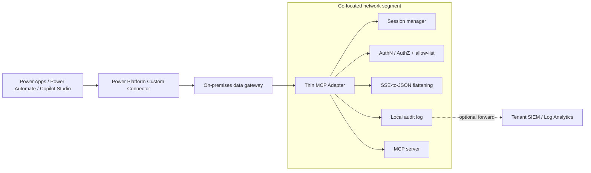

# Executive Summary: Variant A2 — Thin MCP Adapter

Status: Draft
Owner: TBD
Last updated: 2026-07-07

Related documents:
- [Power Platform Private MCP Proxy Connector Spec](./power-platform-mcp-private-proxy-connector-spec.md) (parent spec)
- [Variant A2: Thin MCP Adapter](./variant-a2-thin-mcp-adapter-spec.md) (detailed design)
- [How-To: Deploy Variant A2 on AWS with Amazon Bedrock AgentCore](./a2-howto-agentcore-bedrock.md) (implementation guide)
- [`shim-agentcore-bedrock/`](../shim-agentcore-bedrock/) (reference implementation)

## What problem this solves

Power Platform makers (Power Apps, Power Automate, Copilot Studio) need a
governed way to call a specific MCP server's tools without that server
being exposed to the public internet, and without Power Platform's custom
connector framework being able to speak MCP's protocol natively. A raw,
direct connection is not viable: the on-premises data gateway doesn't
support API-key auth, MCP's single multiplexed JSON-RPC endpoint doesn't
map cleanly onto OpenAPI's per-path/verb model, and Power Automate/Power
Apps cannot parse MCP's streaming (SSE) responses.

Variant A2 solves this with a small, purpose-built adapter deployed next to
one MCP server. It is the "lightweight, single-team, single-server"
alternative to a centrally hosted proxy (Variant A1) — appropriate when one
team owns one MCP server and doesn't want to stand up shared Azure
infrastructure first.

## Who this is for

| Audience | What they get |
| --- | --- |
| Maker (Power Apps / Power Automate / Copilot Studio) | Calls approved MCP tools as ordinary connector actions, with no MCP protocol knowledge required. |
| Platform admin | A narrow, explicit allow-list of exposed tools/resources/prompts per server, enforced at the adapter. |
| Network/security admin | No public listener; all traffic stays on private network paths end to end. |
| MCP service owner | Publishes tools through a governed facade without modifying the MCP server itself. |

## Architecture at a glance

**One adapter instance fronts exactly one MCP server.** It performs the MCP
`initialize` handshake and session management, flattens streaming (SSE)
responses into plain JSON that Power Platform can consume, authenticates
the caller independently of the gateway hop, validates tool/prompt
arguments against JSON schemas, enforces a per-server allow-list, and emits
structured audit records — all without requiring a centrally hosted proxy.

The connector itself uses the **same OpenAPI contract** as the centrally
hosted alternative (Variant A1); only the connection's base URL differs.
This means a maker's flows/apps need no changes if the organization later
migrates from a local adapter to a central proxy.

## Reference implementation: AWS Bedrock AgentCore

The [`shim-agentcore-bedrock/`](../shim-agentcore-bedrock/) reference
implementation targets an MCP server hosted in **Amazon Bedrock AgentCore
Runtime**. AgentCore materially simplifies the adapter's job:

- **Hosts the MCP server directly** and auto-manages MCP session headers,
  removing that responsibility from the adapter.
- **Defaults to IAM SigV4 authentication**, so the adapter authenticates to
  AWS using its own IAM role — no separate OAuth client or identity
  provider integration needed just to reach the backend.
- **Has a native AWS PrivateLink interface endpoint**, so the adapter-to-
  backend hop never traverses the public internet.

End-to-end connectivity has two private hops: gateway → adapter (over AWS
Direct Connect or a Site-to-Site VPN into the VPC) and adapter → AgentCore
(over PrivateLink). Neither hop uses a public endpoint.

## What's explicitly out of scope

- Routing across multiple MCP servers — one adapter per server, always.
- Cross-server quota, rate limiting, or centralized audit aggregation
  (that remains Variant A1's job).
- Acting as a search, retrieval, or indexing layer over large datasets —
  this is a governed, per-call tool relay, not a substitute for an indexed
  grounding source. See the how-to guide's
  [Design trade-offs and caveats](./a2-howto-agentcore-bedrock.md#design-trade-offs-and-caveats)
  for why this matters for broad AI-assistant grounding scenarios,
  including curated (medallion-architecture) data.
- Multi-tenant isolation beyond what the backend MCP server itself
  provides.

## Key trade-offs to carry into a decision

| Trade-off | Summary |
| --- | --- |
| Governance is local, not central | Each adapter instance enforces its own allow-list and audit log. Fine for one team/one server; does not give you a single cross-server policy point. Use Variant A1 if you need that. |
| Latency is additive, not negligible | Gateway relay, private-network transit, session handshakes, and full SSE buffering all add real, non-tunable latency. This is a request/response design, not a low-latency or streaming path. |
| Feasibility depends on network prerequisites this repo doesn't provide | On-premises-to-AWS private connectivity (Direct Connect/VPN) and DNS resolution from the gateway host into the VPC must already exist or be actively provisioned — this is typically a separate networking project, not a same-day setup. |
| Not a grounding/retrieval layer | Do not point a broad AI-assistant grounding scenario (including one built on curated, medallion-architecture data) at this adapter. Ground assistants against an indexed copy of curated data through your organization's standard search/grounding integration; reserve this adapter for discrete, governed tool actions. |

## Path to production

1. Confirm the [feasibility pre-flight checklist](./a2-howto-agentcore-bedrock.md#feasibility-pre-flight-checklist)
   — primarily, that private network connectivity between on-premises and
   the target cloud VPC already exists or is scheduled.
2. Deploy the MCP server to its hosting runtime, then the adapter next to
   it, following the step-by-step [how-to guide](./a2-howto-agentcore-bedrock.md).
3. Apply the [security hardening checklist](./variant-a2-thin-mcp-adapter-spec.md#security-hardening-checklist)
   before exposing the connector to makers.
4. Validate end to end using the guide's
   [Step 8 validation sequence](./a2-howto-agentcore-bedrock.md#step-8-validate-end-to-end).
5. Revisit [Migration path to Variant A1](./variant-a2-thin-mcp-adapter-spec.md#migration-path-to-variant-a1)
   if/when the number of MCP servers or the need for centralized governance
   grows beyond what one team/one adapter can reasonably own.

## Bottom line

Variant A2 is the right choice for **one team fronting one MCP server**
with governed, private access from Power Platform, at lower infrastructure
cost than a centrally hosted proxy. It is not the right choice for
cross-server governance, low-latency/streaming interactions, or grounding
an AI assistant on a large or curated dataset — those are different
problems with different, purpose-built solutions.
