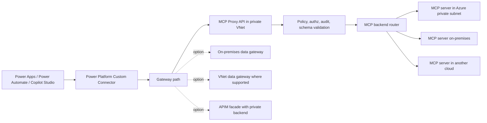

# Power Platform Private MCP Proxy Connector Spec

Status: Draft  
Owner: TBD  
Last updated: 2026-07-06

## Summary

Build a Power Platform custom connector that exposes a governed, low-code interface to MCP servers running on-premises, in Azure private networks, or in another cloud over private connectivity. The connector calls a private MCP proxy service hosted in a customer-controlled virtual network. The proxy translates Power Platform-friendly REST operations into MCP protocol calls and routes traffic to configured MCP backends over private paths.

Important platform constraint: a Power Platform custom connector is connector metadata hosted by Power Platform; it does not itself "live" inside a VNet. The private runtime component is the MCP proxy API. Private connectivity from Power Platform to that proxy is provided through an on-premises data gateway, VNet data gateway where supported, or an API Management facade pattern.

## Goals

1. Provide Power Apps, Power Automate, and Copilot Studio makers with a custom connector for approved MCP tools and resources.
2. Keep MCP server traffic on private network paths from the proxy to on-premises or cross-cloud backends.
3. Centralize identity, authorization, policy enforcement, audit logging, throttling, and data-loss controls at the proxy.
4. Support multiple MCP server targets without requiring each maker to know backend network details.
5. Preserve least privilege by exposing only allow-listed MCP tools, prompts, and resources.

## Non-goals

1. Directly exposing arbitrary MCP servers to the public internet.
2. Supporting ungoverned dynamic tool execution from Power Platform.
3. Replacing Power Platform DLP policies, environment security, or connector governance.
4. Providing native streaming responses to Power Platform. The initial connector is request/response only.
5. Running arbitrary user-supplied code inside the proxy.

## Target users

| User | Need |
| --- | --- |
| Maker | Call approved MCP tools from flows, apps, and agents without understanding MCP internals. |
| Platform admin | Govern which environments can use the connector and which MCP capabilities are exposed. |
| Network/security admin | Keep backend traffic private and inspectable. |
| MCP service owner | Publish tools through a controlled facade without changing the MCP server deployment. |

## Reference architecture



## Connectivity patterns

### Pattern A: Custom connector plus data gateway

Use when the proxy endpoint must remain private and Power Platform should not call a public endpoint. Pattern A has two deployment variants for where the proxy/adapter runs. Both variants still require a translation layer between the connector and the MCP server; see [Why not skip the proxy and call MCP directly?](#why-not-skip-the-proxy-and-call-mcp-directly) for why a raw pass-through to the MCP server is not viable, even for a single-server scenario.

#### Variant A1: Centrally hosted proxy (Azure VNet)

1. Deploy the MCP proxy API in an Azure VNet or private hosting environment.
2. Install an on-premises data gateway in a network that can resolve and reach the proxy private FQDN.
3. Configure the custom connector to use the gateway for the proxy base URL.
4. The gateway maintains outbound connectivity to Power Platform and initiates private calls to the proxy.
5. The proxy reaches MCP servers over ExpressRoute, site-to-site VPN, Private Link, or cross-cloud private interconnect.

Use when multiple MCP servers across multiple networks need one shared, centrally governed facade, or when the team operating the proxy differs from the teams operating individual MCP servers.

Tradeoffs: strongest central governance and a single point of policy enforcement, but adds an extra network hop and a shared service to operate.

#### Variant A2: Thin adapter co-located with the MCP server

1. Deploy a lightweight adapter process on the same network segment as the MCP server (on-premises, or in the other cloud) instead of centrally in Azure.
2. The adapter's only jobs are: perform the MCP `initialize` handshake and session management, flatten SSE/streaming responses into plain JSON, normalize authentication, and expose one clean REST path per MCP tool/resource/prompt.
3. Install an on-premises data gateway that can reach the adapter's local endpoint.
4. Configure the custom connector to use the gateway for the adapter base URL.
5. Apply the same allow-list, schema validation, and audit logging responsibilities described in [Components](#components), running next to the MCP server instead of in a shared Azure service.

Use when there is a single MCP server, or a small number owned by one team, and standing up a centrally hosted Azure proxy is not yet justified.

Tradeoffs: less infrastructure to stand up and lower latency to the MCP server, but governance and audit are local to each adapter instance instead of centralized, and adapters must be deployed and updated per MCP server.

See the detailed design: [Variant A2: Thin MCP Adapter](./variant-a2-thin-mcp-adapter-spec.md).

Both variants keep the gateway's role identical: it only bridges network reachability. Neither variant asks the gateway itself to speak MCP; that job always belongs to the proxy or adapter.

### Why not skip the proxy and call MCP directly?

It is possible to point the on-premises data gateway straight at an MCP server's HTTP endpoint with no adapter in between, but this is not recommended beyond narrow, single-server, low-governance scenarios. Verified platform constraints:

| Constraint | Detail | Source |
| --- | --- | --- |
| API key auth unsupported via gateway | The on-premises data gateway explicitly excludes API Key as a supported custom connector authentication type. Basic auth, Windows auth, or Entra ID/generic OAuth 2.0 (token issuance happens directly against the public identity provider; only the resulting bearer-token call is tunneled through the gateway) are the workable options. | [Custom connector FAQ](https://learn.microsoft.com/en-us/connectors/custom-connectors/faq) |
| OpenAPI 2.0 only | Custom connectors are defined using OpenAPI 2.0 (Swagger), not 3.0. MCP tool argument schemas are JSON Schema and do not always downgrade cleanly (`oneOf`/`anyOf`/conditionals, tuple arrays, and so on), so some MCP tools cannot be represented as connector operations without a translation layer. | [Custom connector FAQ](https://learn.microsoft.com/en-us/connectors/custom-connectors/faq) |
| Single multiplexed endpoint | MCP's Streamable HTTP transport exposes one JSON-RPC endpoint for every method (`initialize`, `tools/list`, `tools/call`, `resources/read`, and so on), selected by a `method` field in the request body. OpenAPI models operations by path and verb, so a direct connector collapses to one generic "call MCP method" action with a freeform JSON-RPC body instead of clean per-tool actions. | MCP specification |
| Session and streaming semantics | Streamable HTTP MCP servers typically require an `initialize` handshake and reuse of an `Mcp-Session-Id` header across calls, and responses can arrive as SSE. The gateway only tunnels bytes; it does not manage session state or parse SSE, and Power Automate/Power Apps do not parse SSE natively either. | MCP specification |
| Gateway payload limits | 2 MB request payload for writes, 2 MB request / 8 MB compressed response for reads, 2048-character URL limit for GET. Adequate for small tool calls, but can be hit by larger resource reads. | [On-premises data gateway overview](https://learn.microsoft.com/en-us/data-integration/gateway/service-gateway-onprem) |
| No governance at the network hop | The gateway does not allow-list tools, validate arguments against a schema, redact fields, or produce a tool-level audit trail. Whatever the MCP server exposes is reachable by anyone with the connection, subject only to the MCP server's own authorization. | — |

Direct-through-gateway is acceptable only when all of the following hold: a single MCP server, a small fixed set of tools the team is willing to hand-encode as OpenAPI 2.0 operations, gateway-compatible auth (Basic, Windows, or Entra ID/OAuth), non-streaming JSON responses, and no requirement for centralized governance beyond gateway and Power Platform admin logs. Variant A2 (thin adapter) removes all of these constraints for a small, fixed cost, so it is the recommended minimum even for single-server scenarios.

### Pattern B: API Management facade with private backend

Use when the organization accepts a public, tightly locked-down facade while keeping backend MCP paths private.

1. Deploy Azure API Management as the connector-facing endpoint.
2. Integrate APIM with the VNet so its backend route to the MCP proxy is private.
3. Require Entra ID OAuth, certificate validation where applicable, IP restrictions where viable, request signing, quotas, and DLP governance.
4. Keep the MCP proxy and MCP servers private.

Tradeoffs: simpler connector runtime path, but the connector-facing endpoint is public unless using a gateway-supported private route.

### Pattern C: Managed environment-specific gateway

Use when Power Platform managed virtual network capabilities are available for the target connector scenario and tenant region. Validate support during design because capability coverage varies by connector type and product surface.

## Components

| Component | Responsibility |
| --- | --- |
| Custom connector | OpenAPI definition, actions, auth configuration, policy templates, maker-facing descriptions. |
| Gateway | Bridges Power Platform connector calls into a private network. |
| MCP proxy API | REST facade for makers; MCP client for backend servers; policy decision point. |
| Backend registry | Stores approved MCP server targets, private endpoint metadata, allowed tools, schemas, and routing rules. |
| Secret store | Holds backend credentials, client certificates, and token exchange configuration. Use Azure Key Vault or equivalent. |
| Audit sink | Stores request metadata, caller identity, target server, tool name, decision, latency, and correlation IDs. |
| Observability stack | Application Insights, Log Analytics, SIEM export, metrics, alerts, and distributed tracing. |

## Connector action model

The connector should expose stable, maker-friendly actions instead of raw JSON-RPC.

| Action | Method | Path | Purpose |
| --- | --- | --- | --- |
| Health check | `GET` | `/health` | Validate proxy availability and configured dependencies. |
| List servers | `GET` | `/v1/servers` | Return MCP server aliases the caller is authorized to use. |
| List tools | `GET` | `/v1/servers/{serverId}/tools` | Return allow-listed tools and JSON schemas for a server. |
| Invoke tool | `POST` | `/v1/servers/{serverId}/tools/{toolName}:invoke` | Execute an approved MCP tool with validated arguments. |
| List resources | `GET` | `/v1/servers/{serverId}/resources` | Return allow-listed resource descriptors. |
| Read resource | `POST` | `/v1/servers/{serverId}/resources:read` | Read an approved MCP resource by URI or resource ID. |
| List prompts | `GET` | `/v1/servers/{serverId}/prompts` | Return approved MCP prompts. |
| Render prompt | `POST` | `/v1/servers/{serverId}/prompts/{promptName}:render` | Render an approved prompt with validated arguments. |

### Request example

```http
POST /v1/servers/erp-prod/tools/getCustomerBalance:invoke
Content-Type: application/json
Authorization: Bearer <token>
x-correlation-id: <guid>

{
  "arguments": {
    "customerId": "C-100045"
  },
  "executionOptions": {
    "timeoutSeconds": 30
  }
}
```

### Response example

```json
{
  "serverId": "erp-prod",
  "toolName": "getCustomerBalance",
  "status": "succeeded",
  "content": [
    {
      "type": "json",
      "value": {
        "customerId": "C-100045",
        "currency": "USD",
        "balance": 1250.75
      }
    }
  ],
  "correlationId": "00000000-0000-0000-0000-000000000000",
  "elapsedMs": 412
}
```

## MCP translation behavior

The proxy acts as an MCP client and normalizes MCP protocol details for Power Platform.

| REST operation | MCP operation |
| --- | --- |
| `GET /tools` | `tools/list` |
| `POST /tools/{toolName}:invoke` | `tools/call` |
| `GET /resources` | `resources/list` |
| `POST /resources:read` | `resources/read` |
| `GET /prompts` | `prompts/list` |
| `POST /prompts/{promptName}:render` | `prompts/get` |

Initial transport support:

1. Streamable HTTP MCP servers.
2. SSE-based MCP servers where still required.
3. Stdio MCP servers only through a controlled sidecar adapter running near the proxy or backend, not by launching arbitrary local processes from connector calls.

## Security requirements

### Authentication

1. Connector users authenticate with Microsoft Entra ID OAuth.
2. The proxy validates issuer, audience, signature, expiry, tenant, and conditional access outcomes where applicable.
3. The proxy maps the caller to authorization policies using Entra ID user, group, app role, managed identity, or Power Platform environment claims.
4. Backend MCP authentication is handled by the proxy using managed identity, OAuth token exchange, mTLS, API keys from Key Vault, or backend-specific credentials.

### Authorization

1. Deny by default for all servers, tools, prompts, and resources.
2. Allow-list exposed capabilities per environment, user/group/app role, and server.
3. Validate tool arguments against the registered JSON schema before invoking MCP.
4. Enforce per-tool timeout, max request size, max response size, and rate limit policies.
5. Optionally require approval workflows for high-impact tools.

### Network security

1. Proxy ingress is private unless Pattern B is explicitly approved.
2. Proxy egress to MCP servers uses private DNS and private routes.
3. No backend MCP server is directly reachable from Power Platform.
4. Use network security groups, firewall rules, and private DNS zones to restrict traffic to approved endpoints.
5. Prefer mTLS for cross-cloud or on-premises private links where identity boundaries are weaker.

### Data protection

1. Do not log full prompts, tool arguments, or tool responses by default.
2. Log only metadata needed for audit: caller, environment, action, server, tool, decision, latency, and correlation ID.
3. Support configurable redaction for selected arguments and response fields.
4. Respect Power Platform DLP policies by placing the custom connector in the correct data group.
5. Tag connector and proxy telemetry with sensitivity classification where available.

## Reliability requirements

| Requirement | Target |
| --- | --- |
| Availability | 99.9% for proxy API excluding gateway and backend MCP server outages. |
| Timeout | Default 30 seconds per connector action; max 120 seconds unless approved. |
| Retries | Retry idempotent reads on transient network failures; do not retry mutating tool calls unless explicitly marked idempotent. |
| Circuit breaker | Per backend server and per tool. |
| Backpressure | Reject with `429` when per-caller, per-environment, or per-backend quotas are exceeded. |
| Async option | Future support for long-running operations through submit/status/result endpoints. |

## Error model

The connector should return deterministic errors that are easy for makers to handle.

| HTTP status | Code | Meaning |
| --- | --- | --- |
| `400` | `InvalidArguments` | Request does not match the registered schema. |
| `401` | `Unauthenticated` | Missing or invalid caller token. |
| `403` | `UnauthorizedTool` | Caller is not allowed to use the target server/tool/resource. |
| `404` | `UnknownTarget` | Server, tool, prompt, or resource is not registered or not visible to caller. |
| `408` | `BackendTimeout` | MCP backend did not respond within policy timeout. |
| `409` | `ToolConflict` | Backend rejected execution due to current state. |
| `429` | `QuotaExceeded` | Rate or concurrency limit exceeded. |
| `502` | `BackendProtocolError` | MCP server returned malformed or unsupported protocol data. |
| `503` | `BackendUnavailable` | Backend server, route, gateway, or dependency unavailable. |

Error response shape:

```json
{
  "error": {
    "code": "UnauthorizedTool",
    "message": "The requested MCP tool is not available to this caller.",
    "correlationId": "00000000-0000-0000-0000-000000000000",
    "details": []
  }
}
```

## Backend registry

Each MCP server registration should include:

```yaml
serverId: erp-prod
displayName: ERP Production MCP
environment: prod
transport: streamable-http
endpoint: https://erp-mcp.internal.contoso.com/mcp
privateDnsZone: internal.contoso.com
auth:
  type: managedIdentityTokenExchange
allowedCapabilities:
  tools:
    - name: getCustomerBalance
      idempotent: true
      timeoutSeconds: 30
      maxRequestBytes: 32768
      maxResponseBytes: 262144
      allowedRoles:
        - FinanceReader
      redactArguments:
        - customerTaxId
  resources: []
  prompts: []
```

## Deployment model

Recommended Azure deployment:

1. Azure Container Apps Environment with VNet integration, Azure App Service Environment, or AKS for the MCP proxy API.
2. Azure Key Vault for secrets, certificates, and backend credentials.
3. Azure App Configuration or GitOps-managed configuration for server registry metadata.
4. Azure Monitor, Application Insights, and Log Analytics for telemetry.
5. Private DNS zones and route tables for on-premises and cross-cloud MCP targets.
6. ExpressRoute, site-to-site VPN, or cloud interconnect for private backend paths.
7. Optional API Management for policy enforcement, facade routing, and developer portal integration.

## Custom connector definition

The custom connector should be generated from an OpenAPI 2.0 (Swagger) document. Power Platform custom connectors do not accept OpenAPI 3.0 definitions; see [Why not skip the proxy and call MCP directly?](#why-not-skip-the-proxy-and-call-mcp-directly). Keeping the proxy's REST facade in [Connector action model](#connector-action-model) simple and flat is what keeps each operation representable in OpenAPI 2.0, since MCP tool JSON schemas do not always downgrade cleanly. The document should include:

1. OAuth 2.0 authorization code flow against Entra ID.
2. Gateway usage enabled for private endpoint patterns.
3. Friendly operation IDs, summaries, descriptions, and examples.
4. Dynamic schema support where feasible for tool arguments.
5. Strongly typed common response envelopes.
6. Policy templates for correlation ID propagation and safe header forwarding.

Connector action naming convention:

| Operation ID | Display name |
| --- | --- |
| `ListMcpServers` | List MCP servers |
| `ListMcpTools` | List MCP tools |
| `InvokeMcpTool` | Invoke MCP tool |
| `ListMcpResources` | List MCP resources |
| `ReadMcpResource` | Read MCP resource |
| `ListMcpPrompts` | List MCP prompts |
| `RenderMcpPrompt` | Render MCP prompt |

## Governance and operations

1. Package connector deployment with Power Platform solutions and environment variables.
2. Assign the connector to the correct Power Platform DLP data group.
3. Require admin approval before enabling production MCP servers.
4. Version OpenAPI definitions and proxy API contracts together.
5. Maintain separate dev/test/prod proxy instances and backend registries.
6. Rotate backend credentials through Key Vault without connector redeployment.
7. Export audit logs to the tenant SIEM.
8. Define break-glass disable switches per server and per tool.

## Open questions

1. Which Power Platform surfaces are in scope first: Power Automate, Power Apps, Copilot Studio, or all three?
2. Which private connectivity pattern is required by policy: data gateway only, APIM facade, or both?
3. Which MCP transports must be supported in v1?
4. Are any tools mutating or high-impact enough to require approval before execution?
5. What response size and execution duration limits are acceptable for maker scenarios?
6. Should the proxy support per-tenant isolation, per-environment isolation, or both?
7. Which audit fields are mandatory for compliance?

## Milestones

| Milestone | Deliverable |
| --- | --- |
| M0 | Architecture decision record for connectivity pattern and hosting model. |
| M1 | OpenAPI draft, connector prototype, and mock proxy. |
| M2 | Proxy MVP with Entra auth, registry, tools/list, and tools/call. |
| M3 | Private connectivity validation to one on-premises or cross-cloud MCP server. |
| M4 | Governance hardening: allow lists, DLP placement, audit export, quotas, and redaction. |
| M5 | Production pilot with selected makers and approved MCP tools. |

## Acceptance criteria

1. A maker can use the custom connector to list and invoke approved MCP tools from a flow.
2. Backend MCP server traffic travels only over approved private network paths.
3. Unauthorized tools and servers are not visible and cannot be invoked directly.
4. All connector calls include correlation IDs and produce audit records.
5. Tool arguments are schema-validated before backend invocation.
6. Secrets are stored outside connector definitions and are never exposed to makers.
7. Network, auth, timeout, and backend protocol failures return documented error shapes.
