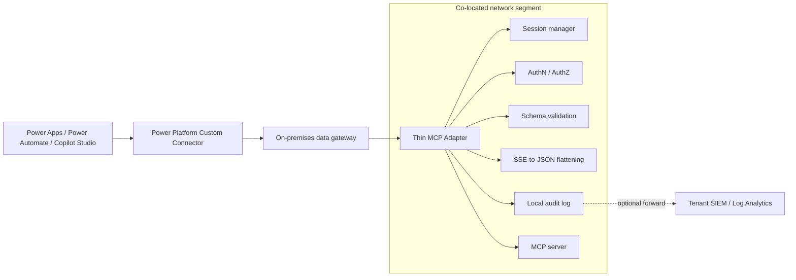
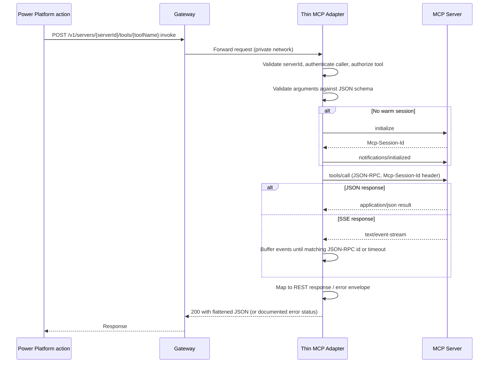

# Variant A2: Thin MCP Adapter (Co-located with the MCP Server)

Status: Draft
Owner: TBD
Last updated: 2026-07-06
Parent spec: [Power Platform Private MCP Proxy Connector Spec](./power-platform-mcp-private-proxy-connector-spec.md) — see Connectivity patterns, Pattern A, Variant A2

## Purpose

This document details Variant A2 of Pattern A: a lightweight MCP adapter deployed on the same network segment as a single MCP server, instead of a centrally hosted proxy in an Azure VNet (Variant A1). It exists so a team can front one MCP server with private, governed access from Power Platform without standing up shared Azure infrastructure first.

The adapter performs the same job as the "MCP proxy API" component in the parent spec — MCP client, REST facade, policy decision point — just scoped to exactly one backend MCP server and deployed next to it.

Concrete implementation guide: [How-To: Deploy Variant A2 on AWS with Amazon Bedrock AgentCore](./a2-howto-agentcore-bedrock.md), with a working reference shim in [`shim-agentcore-bedrock/`](../shim-agentcore-bedrock/).

## When to use A2 vs A1

| Situation | Recommended variant |
| --- | --- |
| One MCP server, one owning team | A2 |
| A pilot or proof of concept before committing to shared infrastructure | A2 |
| Multiple MCP servers across different networks needing one shared, centrally governed facade | A1 |
| Central platform team owns governance separately from the teams running MCP servers | A1 |
| Need centralized cross-server audit, quota, and rate-limit policy in one place | A1 |
| Backend network is fully disconnected from Azure (no outbound path for a central proxy to reach it) | A2 |

A2 is not a permanent architectural fork from A1: see [Migration path to Variant A1](#migration-path-to-variant-a1).

## Design decision: reuse the parent OpenAPI contract

The adapter exposes the **same OpenAPI 2.0 contract and connector action model** defined in the parent spec's [Connector action model](./power-platform-mcp-private-proxy-connector-spec.md#connector-action-model), including the `{serverId}` path segment, rather than a bespoke single-server API shape.

Rationale:

1. One custom connector definition works against either an A1 central proxy or an A2 adapter — only the connection's base URL changes.
2. Migrating a maker's flows and apps from A2 to A1 later requires no changes to the actions or schemas they already use.
3. Certification and maintenance stay on a single connector artifact regardless of how many A2 adapters exist across sites.

The adapter is configured with exactly one `serverId` value (see [Configuration](#configuration)) and rejects any request whose `{serverId}` path segment does not match it, returning `404 UnknownTarget`.

## Architecture



The gateway only bridges network reachability. It does not need to run on the same host as the adapter — it needs DNS resolution, routing, and firewall access to the adapter's host and port. Co-locating the gateway and adapter on the same host is common for single-server pilots but not required.

## Scope

### In scope (adapter responsibilities)

1. Terminate the connector's REST calls and translate them to MCP JSON-RPC.
2. Perform the MCP `initialize` handshake and maintain session state (see [MCP session management](#mcp-session-management)).
3. Flatten SSE/streaming MCP responses into a single JSON response (see [Streaming response flattening](#streaming-response-flattening-sse-to-json)).
4. Enforce the allow-list of tools, prompts, and resources for its one configured server.
5. Validate tool/prompt arguments against registered JSON schemas before calling the backend.
6. Normalize authentication: accept a gateway-compatible caller credential, authenticate to the MCP server using whatever the backend requires.
7. Emit local audit records with correlation IDs, optionally forwarding them centrally.
8. Expose the shared `/health` action.

### Explicitly out of scope

1. Routing across multiple MCP servers. One adapter instance fronts exactly one server; deploy one adapter per server.
2. Cross-server quota, rate limiting, or audit aggregation. That is Variant A1's job.
3. Central secret rotation UI or a full Key Vault-integrated registry. A2 uses local, simpler secret handling (see [Security hardening](#security-hardening-checklist)).
4. Multi-tenant isolation beyond what the single backend MCP server itself provides.

## Request lifecycle



## MCP session management

The adapter must decide how to reuse `Mcp-Session-Id` across calls from potentially many concurrent Power Platform callers.

| Strategy | Behavior | Tradeoff |
| --- | --- | --- |
| Shared session pool (default) | A small pool of warm sessions is kept open with the MCP server and multiplexed across callers. | Lowest handshake overhead; risk of state bleed if the backend MCP server keeps caller-specific state (subscriptions, roots, sampling context) tied to a session. |
| Per-caller session | One session per authenticated caller identity, cached with an idle TTL and re-initialized on expiry. | Avoids state bleed between callers; more handshake overhead and session bookkeeping. |
| Per-request session | A fresh `initialize` handshake for every tool call, closed immediately after. | Safest isolation; highest latency and load on the MCP server; use only for low-volume or highly sensitive tools. |

Recommended default: **per-caller session with idle TTL** (for example, 10 minutes), falling back to shared pooling only for MCP servers confirmed to be stateless beyond the handshake. Record the chosen strategy per server in [Configuration](#configuration).

Session failures (expired, revoked, or rejected by the backend) trigger one transparent re-initialize-and-retry before surfacing `503 BackendUnavailable` to the caller.

## Streaming response flattening (SSE to JSON)

Power Automate and Power Apps do not natively parse `text/event-stream`, so the adapter always returns plain JSON:

1. Issue the JSON-RPC request to the MCP endpoint.
2. If the response `Content-Type` is `application/json`, parse and return it directly.
3. If the response `Content-Type` is `text/event-stream`, read events until the JSON-RPC response matching the request `id` arrives, buffering any interim progress or log notifications into an `events` array on the final response.
4. Enforce the connector action's configured timeout (see the parent spec's [Reliability requirements](./power-platform-mcp-private-proxy-connector-spec.md#reliability-requirements)); on timeout, close the stream and return `408 BackendTimeout`.
5. Enforce a maximum buffered byte size (default aligned to the gateway's 8 MB compressed read response limit); if exceeded, close the stream and return `502 BackendProtocolError`.

## Authentication model

| Hop | Mechanism | Notes |
| --- | --- | --- |
| Maker to connector | Whatever the connector's security definition specifies. | Must be gateway-compatible: Basic, Windows, or Entra ID/generic OAuth 2.0. API Key is not supported through the gateway. |
| Connector to adapter (via gateway) | Same credential, forwarded by the gateway. | The adapter re-validates the credential; it does not trust the gateway hop implicitly. |
| Adapter to MCP server | Backend-specific: static credential from local secret storage, mTLS client certificate, or OAuth token exchange. | Configured per adapter instance since each fronts exactly one server. |

Caller identity resolved by the adapter drives the tool/prompt/resource allow-list check described in [Scope](#scope).

## Configuration

Each adapter instance is configured with exactly one server entry, reusing the shape of the parent spec's [Backend registry](./power-platform-mcp-private-proxy-connector-spec.md#backend-registry) but without the multi-server list wrapper:

```yaml
serverId: erp-onprem
displayName: ERP On-Premises MCP
transport: streamable-http
endpoint: https://erp-mcp.local.contoso.com/mcp
sessionStrategy: per-caller
sessionIdleTtlMinutes: 10
auth:
  callerAcceptedTypes:
    - basic
    - windows
    - oauthEntraId
  backend:
    type: staticCredential
    secretRef: local-secret-store://erp-mcp-adapter-credential
allowedCapabilities:
  tools:
    - name: getCustomerBalance
      idempotent: true
      timeoutSeconds: 30
      maxResponseBytes: 262144
      allowedRoles:
        - FinanceReader
      redactArguments:
        - customerTaxId
  resources: []
  prompts: []
audit:
  localPath: C:\mcp-adapter\logs\audit.log
  forwardToSiem: false
```

Configuration is kept outside the adapter's deployable artifact so the same versioned build runs at every site; only this file (or equivalent environment variables) differs per deployment.

## Connector action model (inherited)

The adapter implements the identical action set from the parent spec:

| Action | Method | Path |
| --- | --- | --- |
| Health check | `GET` | `/health` |
| List servers | `GET` | `/v1/servers` (always returns the single configured server) |
| List tools | `GET` | `/v1/servers/{serverId}/tools` |
| Invoke tool | `POST` | `/v1/servers/{serverId}/tools/{toolName}:invoke` |
| List resources | `GET` | `/v1/servers/{serverId}/resources` |
| Read resource | `POST` | `/v1/servers/{serverId}/resources:read` |
| List prompts | `GET` | `/v1/servers/{serverId}/prompts` |
| Render prompt | `POST` | `/v1/servers/{serverId}/prompts/{promptName}:render` |

No new operations are introduced by this variant.

## Error handling (inherited)

Reuses the parent spec's [Error model](./power-platform-mcp-private-proxy-connector-spec.md#error-model) and response envelope without modification. The only addition is that `UnknownTarget` (`404`) also covers a `{serverId}` path segment that does not match the adapter's single configured server.

## Deployment topology

| Option | Notes |
| --- | --- |
| Windows service | Fits on-premises Windows-centric environments; run under a dedicated least-privilege service account. |
| Linux systemd service | For Linux-hosted on-premises or other-cloud segments. |
| Container (standalone) | Deployed on a small VM or appliance next to the MCP server. |
| Sidecar container | Deployed in the same pod/namespace as the MCP server when it already runs in a container platform. |

In all options, the adapter binds to an internal-only interface reachable solely by the gateway host(s), never to a public interface.

## Security summary

A consolidated view of the controls described throughout this document, for reviewers who need the security posture without reading the full spec.

| Concern | Control | Where enforced |
| --- | --- | --- |
| Network exposure | No public listener; adapter binds to an internal-only interface reachable solely by the approved gateway host(s) via firewall/NSG rule. | [Deployment topology](#deployment-topology), [Security hardening checklist](#security-hardening-checklist) |
| Transport security | TLS between gateway and adapter even on trusted internal networks (internal CA or pinned certificate). | [Security hardening checklist](#security-hardening-checklist) |
| Caller authentication | Adapter independently re-validates the caller credential forwarded by the gateway (Basic, Windows, or Entra ID/OAuth 2.0); it never trusts the gateway hop implicitly. | [Authentication model](#authentication-model) |
| Backend authentication | Adapter-to-MCP-server credential (static credential, mTLS client cert, or OAuth token exchange) is configured per instance and stored in an OS-level secret store or local encrypted file, or Azure Key Vault when reachable. | [Authentication model](#authentication-model), [Security hardening checklist](#security-hardening-checklist) |
| Authorization | Per-server allow-list of tools/prompts/resources; JSON schema validation of arguments before any backend call; requests for a non-matching `serverId` are rejected with `404 UnknownTarget`. | [Scope](#scope), [Configuration](#configuration) |
| Process privilege | Adapter runs under a dedicated, least-privilege service account — never local admin/root. | [Security hardening checklist](#security-hardening-checklist) |
| Session isolation | Configurable session strategy (per-request, per-caller, or shared pool) to bound state bleed risk between callers; failed sessions trigger one transparent re-initialize-and-retry before surfacing an error. | [MCP session management](#mcp-session-management) |
| Data protection | No full prompts, tool arguments, or tool responses logged by default; sensitive arguments are redacted per the configured `redactArguments` list; streamed responses are size- and time-bounded to prevent unbounded buffering. | [Streaming response flattening](#streaming-response-flattening-sse-to-json), [Security hardening checklist](#security-hardening-checklist) |
| Audit trail | Structured local audit log (caller, environment, action, server, tool, decision, latency, correlation ID) with optional forwarding to a tenant SIEM/Log Analytics. | [Observability and audit logging](#observability-and-audit-logging) |
| Supply chain / integrity | The single versioned adapter artifact is signed or deployed by pinned digest before rollout to a new site. | [Security hardening checklist](#security-hardening-checklist), [Versioning and update strategy](#versioning-and-update-strategy) |
| Multi-tenant isolation | Explicitly out of scope beyond what the single backend MCP server itself provides — do not rely on this adapter for tenant separation. | [Scope](#scope) |

Residual risks and open items are tracked in [Open questions](#open-questions) (notably backend credential storage for fully disconnected sites, and the default session pooling strategy).

## Security hardening checklist

1. No public listener; reachable only from approved gateway host(s) via firewall/NSG rule.
2. TLS between gateway and adapter even on a trusted internal network, using an internal CA or pinned certificate.
3. Adapter process runs under a dedicated, least-privilege service account (not local admin/root).
4. Backend MCP credentials stored in an OS-level secret store (for example, Windows Credential Manager/DPAPI) or a local encrypted file when Azure Key Vault is unreachable; use Key Vault directly when outbound connectivity allows it.
5. No full prompts, tool arguments, or tool responses logged by default; same redaction rules as the parent spec's [Data protection](./power-platform-mcp-private-proxy-connector-spec.md#data-protection) requirements.
6. Adapter binary/image is versioned and integrity-checked (signed artifact or pinned digest) before deployment to a new site.

## Observability and audit logging

The adapter emits the same audit fields as the parent spec's Audit sink component — caller, environment, action, server, tool, decision, latency, correlation ID — to a local log by default. Forwarding to the tenant SIEM or Log Analytics is optional and configurable per site (`audit.forwardToSiem`), since not every co-located network segment has an outbound path to central logging.

## Reliability and scaling

| Requirement | Target |
| --- | --- |
| Instance count | Single instance acceptable for pilots; active-passive pair with a local load balancer for production if HA is required. |
| Availability | Bounded by the single backend MCP server's own availability; the adapter adds negligible additional failure surface when kept simple. |
| Scaling | Not auto-scaled; capacity is scoped to what the one backend MCP server can serve. |
| Health monitoring | Gateway or local monitoring polls the shared `/health` action. |

## Versioning and update strategy

1. Build one versioned adapter artifact (container image or signed binary) used at every site.
2. Keep per-site configuration (server entry, allow-lists, secrets) outside the artifact so updates don't require rebuilding per site.
3. Roll out updates site by site with the health check as a post-deploy gate.

## Migration path to Variant A1

Because the OpenAPI contract is shared:

1. Stand up the central Variant A1 proxy and register the same `serverId`, allow-list, and schemas in its backend registry.
2. Point the custom connector's connection at the central proxy's base URL (new connection, or an environment variable swap in the existing one).
3. Decommission the local adapter once traffic is confirmed flowing through the central proxy.
4. No changes are required to maker-authored flows, apps, or agents, since actions and schemas are unchanged.

## Acceptance criteria

1. A single MCP server is reachable from Power Platform only through the gateway and this adapter — never directly.
2. The adapter performs the MCP handshake and session reuse transparently; callers never see `Mcp-Session-Id`.
3. SSE responses are flattened to plain JSON within configured timeout and size limits.
4. The adapter enforces the same allow-list, schema validation, and audit requirements as the parent spec, scoped to its one server.
5. The connector's OpenAPI contract is identical to Variant A1's; only the connection's base URL differs.
6. The adapter can be redeployed or updated without changing the custom connector definition or any maker-authored flow.

## Open questions

1. Should session pooling default to per-caller or shared, and does that decision vary by MCP server?
2. Where should backend MCP credentials live for fully disconnected on-premises sites with no path to Azure Key Vault?
3. Is HA required for the pilot, or is single-instance acceptable with a defined recovery time objective?
4. Which artifact format (container vs. native service) does the network/security admin team prefer for on-premises rollout?
5. Who owns adapter patching and updates per site: the central platform team or local site admins?
